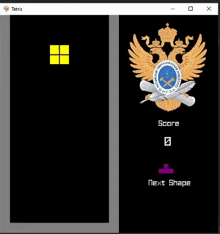

# Игра тетрис для курсовой работы в МИРЭА
### Программа написана на языке с++ с использованием графической библиотеки SFML

____
# Как играть
- `LEFT` - Перемещение фигуры влево на одну клетку.
- `RIGHT` - Перемещение фигуры вправо на одну клетку.
- `DOWN` - Ускорение падения фигуры.
- `UP` - Поворот фигуры на 90 градусов.
____
# Установка
### Используя архив
1. Скачайте архив [tetris_mirea.rar](https://github.com/kripistor/tetris_mirea/blob/master/tetris_mirea.rar)
2. Разархивируйте архив и запустите файл `tetris_mirea.exe`
### Используя CMake
1. Скачайте или скопируйте репозиторий
2. Скачайте библиотеку [SFML](https://www.sfml-dev.org/download/sfml/2.5.1/)
3. Укажите путь к библиотеки в CMakeLists.txt
```
cmake_minimum_required(VERSION 3.24)
project(tetris_mirea)

set(CMAKE_CXX_STANDARD 17)

add_executable(tetris_mirea WIN32 main.cpp tetris.cpp board.cpp)
file(COPY fonts DESTINATION ${CMAKE_BINARY_DIR})
set(SFML_STATIC_LIBRARIES TRUE)
set(SFML_DIR "Ваш путь")
find_package(SFML COMPONENTS system window graphics network audio REQUIRED)
file(COPY "img" DESTINATION ${CMAKE_BINARY_DIR})

target_link_libraries(tetris_mirea sfml-system sfml-window sfml-graphics sfml-network sfml-audio)
set(CMAKE_EXE_LINKER_FLAGS -static)
```
5. Создайте каталог сборки в корне проекта
```
cmake ..
cmake --build .
```
6. Запустите сгенерированный исполняемый файл (named `your_project_name` or `your_project_name.exe` on Windows): `./your_project_name`
